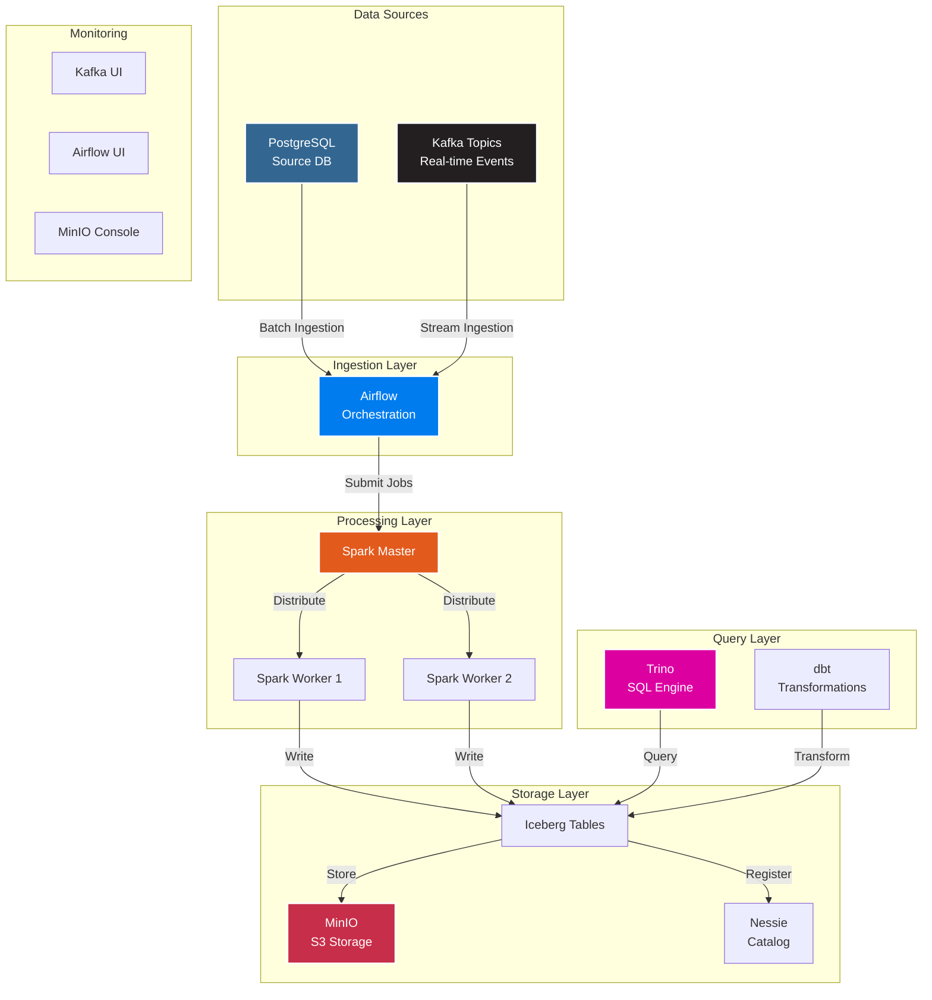

<div align="center">

# 🏗️ Modern Data Lakehouse Platform

[](https://opensource.org/licenses/MIT)
[](https://www.docker.com/)
[](https://spark.apache.org/)
[](https://kafka.apache.org/)
[](https://airflow.apache.org/)

**A complete, production-ready data lakehouse stack with real-time streaming, distributed processing, and Git-like data versioning**

[Features](#-features) • [Quick Start](#-quick-start) • [Architecture](#-architecture) • [Documentation](#-documentation) • [Screenshots](#-screenshots)

</div>

---

## 🎯 Overview

This project delivers a **modern data lakehouse platform** built with industry-standard open-source technologies. It combines the flexibility of data lakes with the structure of data warehouses, enabling real-time analytics, machine learning, and business intelligence at scale.

### 💡 What is a Data Lakehouse?

A data lakehouse is a new paradigm that combines:
- **Data Lake flexibility** - Store all your data (structured, semi-structured, unstructured)
- **Data Warehouse performance** - ACID transactions, schema enforcement, query optimization
- **Real-time streaming** - Process events as they happen
- **Git-like versioning** - Time travel, branching, and merging for data

---

## ✨ Features

<table>
<tr>
<td width="50%">

### 🔄 Real-Time Streaming
- **Apache Kafka** for event streaming
- **Kafka UI** for monitoring and management
- Built-in consumer groups and topics
- Scalable partition architecture

</td>
<td width="50%">

### ⚡ Distributed Processing
- **Apache Spark** (Master + Workers)
- Configurable executor resources
- Support for Python, Scala, SQL
- Iceberg table format integration

</td>
</tr>
<tr>
<td>

### 🗄️ Modern Storage
- **MinIO** S3-compatible object storage
- **Apache Iceberg** table format
- Schema evolution support
- Partition pruning optimization

</td>
<td>

### 📊 Data Catalog
- **Nessie** catalog with Git-like operations
- Branch and merge data versions
- Time travel queries
- Multi-table transactions

</td>
</tr>
<tr>
<td>

### 🔍 Query Engine
- **Trino** distributed SQL engine
- Query across multiple data sources
- Join tables from different systems
- Sub-second query performance

</td>
<td>

### 🔄 Orchestration
- **Apache Airflow** workflow management
- Visual DAG editor
- Task dependencies and retries
- Integration with dbt

</td>
</tr>
</table>

---

## 🏛️ Architecture



### 🔄 Data Flow

1. **Ingestion**: Data flows from PostgreSQL (batch) and Kafka (streaming) into the lakehouse
2. **Processing**: Spark workers process and transform data in parallel
3. **Storage**: Iceberg tables are stored in MinIO with metadata in Nessie
4. **Transformation**: dbt models refine data from Bronze → Silver → Gold layers
5. **Query**: Trino enables SQL queries across all data sources
6. **Orchestration**: Airflow manages the entire pipeline

---

## 🚀 Quick Start

### Prerequisites

- **Docker Desktop** 20.10+ with Docker Compose
- **Minimum** 8GB RAM (16GB recommended for full stack)
- **20GB** free disk space
- **Git** for cloning the repository

### 📥 Installation

```bash
# 1. Clone the repository
git clone https://github.com/yourusername/lakehouse-platform.git
cd lakehouse-platform

# 2. Create required directories
mkdir -p airflow/{dags,plugins,config}
mkdir -p spark/{apps,data,jars}
mkdir -p trino/catalog
mkdir -p dbt

# 3. Make init script executable
chmod +x init-db.sh

# 4. Start the platform
docker-compose up -d

# 5. Wait for services to be healthy (2-3 minutes)
docker-compose ps

# 6. Check service status
curl http://localhost:8085/health  # Airflow
curl http://localhost:9000/minio/health/live  # MinIO
```

### ✅ Verify Installation

All services should show status `Up` or `healthy`:

```bash
$ docker-compose ps

NAME                    STATUS              PORTS
lakehouse-airflow       Up (healthy)        8085
lakehouse-kafka         Up                  9092, 9094
lakehouse-kafka-ui      Up                  8084
lakehouse-minio         Up (healthy)        9000-9001
lakehouse-nessie        Up (healthy)        19120
lakehouse-postgres      Up (healthy)        5432
lakehouse-spark-master  Up                  4040, 7077, 8088
lakehouse-spark-worker-1 Up                 8081
trino                   Up                  8080
```

---

## 📊 Services & Ports

<div align="center">

| Service | Logo | Port(s) | Web UI | Credentials |
|---------|------|---------|--------|-------------|
| **MinIO** |  | 9000, 9001 | [localhost:9001](http://localhost:9001) | `minioadmin` / `minioadmin123` |
| **Nessie** |  | 19120 | [localhost:19120/api/v1](http://localhost:19120/api/v1) | - |
| **PostgreSQL** |  | 5432 | - | `airflow` / `airflow` |
| **Spark Master** |  | 7077, 8088, 4040 | [localhost:8088](http://localhost:8088) | - |
| **Spark Worker** |  | 8081 | [localhost:8081](http://localhost:8081) | - |
| **Trino** |  | 8080 | [localhost:8080](http://localhost:8080) | `admin` (no password) |
| **Airflow** |  | 8085 | [localhost:8085](http://localhost:8085) | `admin` / `admin123` |
| **Kafka** |  | 9092, 9094 | - | - |
| **Kafka UI** |  | 8084 | [localhost:8084](http://localhost:8084) | - |

</div>

---

## Tools Works

<details>
<summary><b>📊 Airflow - Workflow Orchestration</b></summary>

### DAG Overview
Monitor all your data pipelines in one place

```
┌─────────────────────────────────────────────────┐
│ DAG: postgres_to_bronze_lakehouse               │
│ ✅ Running  │ Last Run: Success  │ Next: 1h     │
├─────────────────────────────────────────────────┤
│ create_bronze_namespace → ingest_sales          │
│                         → ingest_customers       │
│                         → ingest_products        │
└─────────────────────────────────────────────────┘
```

</details>

<details>
<summary><b>📦 MinIO - Object Storage</b></summary>

### Bucket Structure
```
warehouse/
├── bronze/
│   ├── sales/
│   │   ├── metadata/
│   │   └── data/
│   ├── customers/
│   └── products/
└── silver/
    ├── sales_enriched/
    └── customer_360/

raw-data/
└── kafka-data/
    └── 2026/01/11/
```

</details>

<details>
<summary><b>⚡ Spark - Distributed Processing</b></summary>

### Cluster Resources
```
Master: spark-master:7077
├── Worker-1: 2 cores, 4GB RAM ✅
└── Worker-2: 4 cores, 6GB RAM ✅

Active Applications: 2
Completed Applications: 147
```

</details>

<details>
<summary><b>📨 Kafka UI - Stream Management</b></summary>

### Topics & Messages
```
Topics:
├── web-messages (3 partitions, 1,234 messages)
├── telegram-messages (3 partitions, 567 messages)
└── orders (5 partitions, 8,901 messages)

Consumer Groups:
└── airflow-consumer-* (LAG: 0 ✅)
```

</details>

---

## 📚 Documentation

### 🔧 Configuration

#### Airflow Variables

Set these in Airflow UI → Admin → Variables:

```json
{
  "MINIO_ENDPOINT": "http://minio:9000",
  "MINIO_ACCESS_KEY": "minioadmin",
  "MINIO_SECRET_KEY": "minioadmin123",
  "BRONZE_WAREHOUSE": "s3a://warehouse/bronze",
  "NESSIE_URI": "http://nessie:19120/api/v1",
  "CATALOG_1": "bronze",
  "BRONZE_SCHEMA": "raw",
  "PG_SOURCE_SCHEMA": "public",
  "POSTGRES_TABLES": "[\"sales\", \"customers\", \"products\"]"
}
```

#### Airflow Connections

Create PostgreSQL connection:

```
Connection ID: postgres_lakehouse
Type: Postgres
Host: postgres
Database: airflow
Login: airflow
Password: airflow
Port: 5432
```

### 💻 Usage Examples

#### Create Kafka Topic

```bash
docker exec -it lakehouse-kafka /opt/kafka/bin/kafka-topics.sh \
  --create \
  --topic my-topic \
  --bootstrap-server localhost:9092 \
  --partitions 3 \
  --replication-factor 1
```

#### Submit Spark Job

```bash
docker exec -it lakehouse-spark-master \
  /opt/spark/bin/spark-submit \
  --master spark://spark-master:7077 \
  --conf spark.executor.memory=2g \
  /opt/spark-apps/my_job.py
```

#### Query with Trino

```bash
docker exec -it trino trino

# In Trino CLI:
trino> SHOW CATALOGS;
trino> USE iceberg.bronze;
trino> SELECT * FROM sales LIMIT 10;
trino> SELECT DATE(order_date), COUNT(*) 
       FROM sales 
       GROUP BY DATE(order_date);
```

#### Python Kafka Producer

```python
from kafka import KafkaProducer
import json

producer = KafkaProducer(
    bootstrap_servers=['localhost:9094'],
    value_serializer=lambda v: json.dumps(v).encode('utf-8')
)

producer.send('my-topic', {'message': 'Hello Lakehouse!'})
producer.flush()
```

Run the local producer with a custom message count:

```bash
python kafka/producer.py 10 --topic testtopic --message "This is my message"
```

Run three consumers in the same group with separate output files:

```bash
python kafka/consumer.py --topic testtopic --group-id testconsumer --workers 3
```

#### Python with MinIO

```python
import boto3

s3 = boto3.client(
    's3',
    endpoint_url='http://localhost:9000',
    aws_access_key_id='minioadmin',
    aws_secret_access_key='minioadmin123'
)

# List buckets
buckets = s3.list_buckets()
print(buckets)

# Upload file
s3.upload_file('data.csv', 'raw-data', 'uploads/data.csv')
```

---

## 📁 Project Structure

```
lakehouse-platform/
├── 📄 docker-compose.yml          # Main orchestration
├── 📄 Dockerfile                  # Custom Airflow image
├── 📄 init-db.sh                  # PostgreSQL initialization
├── 📄 requirements.txt            # Python dependencies
├── 📄 README.md                   # This file
│
├── 📂 airflow/
│   ├── 📂 dags/                   # Airflow DAGs
│   │   ├── postgres_to_bronze_lakehouse.py
│   │   ├── hourly_kafka_to_minio.py
│   │   └── dbt/
│   │       └── dbt_lakehouse/     # dbt project
│   ├── 📂 logs/                   # Legacy local logs folder (optional)
│   ├── 📂 plugins/                # Custom plugins
│   └── 📂 config/                 # Airflow config
│
├── 📂 spark/
│   ├── 📂 apps/                   # Spark applications
│   ├── 📂 data/                   # Spark data files
│   └── 📂 jars/                   # JAR dependencies
│
├── 📂 trino/
│   └── 📂 catalog/                # Trino catalog configs
│
└── 📂 dbt/                        # Additional dbt projects
```

---

## 🎓 Learning Resources

### 📖 Component Documentation

- [Apache Spark Documentation](https://spark.apache.org/docs/latest/)
- [Apache Kafka Documentation](https://kafka.apache.org/documentation/)
- [Apache Airflow Documentation](https://airflow.apache.org/docs/)
- [Apache Iceberg Documentation](https://iceberg.apache.org/docs/latest/)
- [Trino Documentation](https://trino.io/docs/current/)
- [MinIO Documentation](https://min.io/docs/minio/linux/index.html)
- [Nessie Documentation](https://projectnessie.org/docs/)
- [dbt Documentation](https://docs.getdbt.com/)

### 🎯 Use Cases

<table>
<tr>
<td width="50%">

**Real-Time Analytics**
- Stream processing with Kafka
- Real-time dashboards
- Event-driven architectures

</td>
<td>

**Machine Learning**
- Feature engineering with Spark
- Model training data pipelines
- ML model versioning

</td>
</tr>
<tr>
<td>

**Data Warehouse Modernization**
- Migrate from traditional DWH
- Reduce storage costs
- Improve query performance

</td>
<td>

**Business Intelligence**
- Self-service analytics
- Ad-hoc querying with Trino
- Scheduled reporting

</td>
</tr>
</table>

---

## 🔍 Monitoring & Troubleshooting

### Health Checks

```bash
# Check all services
docker-compose ps

# View logs
docker-compose logs -f airflow
docker-compose logs -f kafka
docker-compose logs -f spark-master

# Resource usage
docker stats

# Restart specific service
docker-compose restart service-name
```

### Common Issues

<details>
<summary><b>🔴 Kafka connection timeout</b></summary>

**Solution**: Ensure `hostname: kafka` is set in docker-compose.yml

```yaml
kafka:
  hostname: kafka  # Required!
  container_name: lakehouse-kafka
```

</details>

<details>
<summary><b>🔴 Spark out of memory</b></summary>

**Solution**: Increase worker memory in docker-compose.yml

```yaml
spark-worker-1:
  environment:
    - SPARK_WORKER_MEMORY=8G  # Increase from 4G
```

</details>

<details>
<summary><b>🔴 Airflow DAG import errors</b></summary>

**Solution**: Check Python dependencies

```bash
docker exec -it lakehouse-airflow pip list
docker-compose restart airflow
```

</details>

---

## 🛠️ Advanced Configuration

### Enable Spark Worker 2

Uncomment in docker-compose.yml:

```yaml
spark-worker-2:
  # ... configuration
```

Then restart:

```bash
docker-compose up -d spark-worker-2
```

### Configure Trino Catalogs

Create files in `./trino/catalog/`:

**iceberg.properties**:
```properties
connector.name=iceberg
iceberg.catalog.type=nessie
iceberg.nessie.uri=http://nessie:19120/api/v1
iceberg.nessie.ref=main
```

### Scale Kafka

Add more brokers in docker-compose.yml for production.

---

## 🤝 Contributing

Contributions are welcome! Please follow these steps:

1. Fork the repository
2. Create a feature branch (`git checkout -b feature/amazing-feature`)
3. Commit your changes (`git commit -m 'Add amazing feature'`)
4. Push to the branch (`git push origin feature/amazing-feature`)
5. Open a Pull Request

---

## 📄 License

This project is licensed under the MIT License - see the [LICENSE](LICENSE) file for details.

---

## 🙏 Acknowledgments

Built with amazing open-source technologies:

- **Apache Software Foundation** - Spark, Kafka, Iceberg, Airflow
- **Trino Foundation** - Trino SQL Engine
- **MinIO** - Object Storage
- **Project Nessie** - Data Catalog
- **dbt Labs** - Data Transformation

---

<div align="center">

### ⭐ Star this repository if you found it helpful!

**[Documentation](https://github.com/yourusername/lakehouse-platform/wiki)** • 
**[Issues](https://github.com/yourusername/lakehouse-platform/issues)** • 
**[Discussions](https://github.com/yourusername/lakehouse-platform/discussions)**

Made with ❤️ by the Data Engineering Community

</div>
